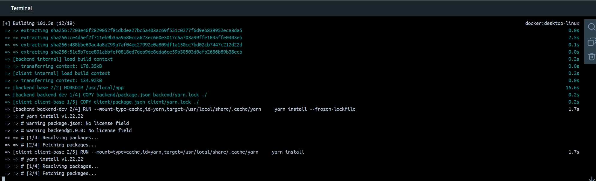

## Docker

После того как мы установили docker, мы можем для примера запустить какой-нибудь контейнер.

## Start the project
Для начала склонируем проект todo.
```
git clone https://github.com/docker/getting-started-todo-app
```
Дальше перейдем в папку с проектом.
```
cd getting-started-todo-app
```
Дальше разворачиваем приложение и запускаем контейнер, с помощью watch можно отслеживать изменение в проекте и автоматически обновлять службы.
```
docker compose watch
```


